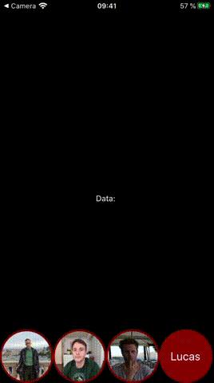

# react-native-grouper

> Customizable animation for flicking elements from one list to another for react-native

## Install

```bash
npm i react-native-grouper
```

## Usage





Basic code for the example above:

```JSX
import React, { useState } from "react";
import { Image, SafeAreaView, StyleSheet, View, Text } from 'react-native';
import { Grouper, SourceList, TargetList } from 'react-native-grouper';

const APP = () => {

  const [names, setNames] = useState([]);  // You need to declare a state and give the setState as a prop to Grouper in order to use the values in your app. You can name it however you like.
 
  return (
    <SafeAreaView style={{ backgroundColor: 'black' }}>
      <Grouper setValues={setNames}>    // the prop needs to be called setValues!
        <TargetList
          style={styles.listitem}>          // styling of the item inside the List
        </TargetList>
        <View style={{ height: '80%' }}> //this View is requiered! Style according to your app
          <Text style={{ marginTop: "50%", color: 'white', alignSelf: 'center' }}>
            Data: {names.join(', ')}   // Just an example to show the data
          </Text>
        </View>
        <SourceList style={styles.listitem}> 
          <Text value={'Lucas'} style={styles.text}>Lucas</Text> // the value prop is important 
          <Image value={'Till'} style={styles.image} 
            source={{ uri: 'https://example-url-to-image.png' }} />
          <Image value={'Andrew'} style={styles.image} 
            source={{ uri: 'https://example-url-to-image.png' }} />
          <Image value={'Steven'} style={styles.image} 
            source={{ uri: 'https://example-url-to-image.png' }} />
        </SourceList>
      </Grouper>
    </SafeAreaView>
  );
};

const styles = StyleSheet.create({
  listitem: {
    height: 93,
    width: 93,
    borderRadius: 50,
    backgroundColor: "maroon",
    justifyContent: "center",
    alignItems: "center",
    margin: 0,
  },
  image: {
    width: 87, 
    height: 87, 
    borderRadius: 60
  },
  text: {
    fontSize: 20, 
    color: 'white'
  }
})

export default APP;
```


## License

[MIT](http://vjpr.mit-license.org)

[npm-image]: https://img.shields.io/npm/v/live-xxx.svg
[npm-url]: https://npmjs.org/package/react-native-grouper
[coveralls-image]: https://img.shields.io/coveralls/live-js/live-xxx/master.svg
[coveralls-url]: https://coveralls.io/r/live-js/live-xxx?branch=master
